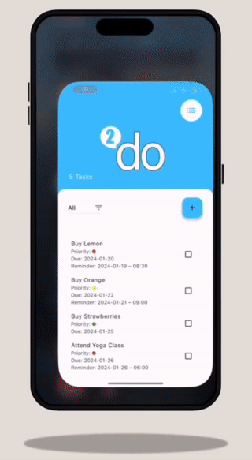

# 2Do Flutter App

ToDoey Flutter App is an intuitive task management application developed using Flutter, leveraging the Provider package for efficient state management. This app is designed to help users efficiently manage their daily tasks with features like setting priorities, due dates, and reminders, all while maintaining a clean and manageable codebase. The inclusion of voice control for task entry enhances user experience and accessibility.

## Table of Contents

- [Installation](#installation)
- [Usage](#usage)
- [Features](#features)
- [Dependencies](#dependencies)
- [Configuration](#configuration)
- [Documentation](#documentation)
- [Troubleshooting](#troubleshooting)
- [Contributors](#contributors)
- [License](#license)

## Installation

To start using 2Do Flutter App, follow these steps:

1. Clone the repository to your local machine.
2. Ensure you have Flutter installed on your system.
3. Navigate to the project directory and run `flutter pub get` to install the required dependencies.

## Usage

After installation, you can run the app on your preferred device or emulator using `flutter run`. Ensure you have an emulator running, or a device connected to your development machine.

## Features

<p align="center">
  
</p>

2Do Flutter App includes the following features:

- **Task Addition**: Easily add tasks with a user-friendly interface.
- **Voice Control**: Add tasks using voice commands for a hands-free experience.
- **Priority Setting**: Assign priority levels (High, Medium, Low) to tasks.
- **Due Date**: Set due dates for each task to manage deadlines effectively.
- **Reminder Alerts**: Set reminders to ensure you never miss important tasks.
- **Task Sorting**: Sort tasks by due date, priority, or custom order.
- **Task Filtering**: Filter tasks to focus on what's relevant at the moment.
- **Task Completion Tracking**: Mark tasks as completed and track your progress.
- **State Management**: Utilizes the Provider package for efficient state management across the app.

## Dependencies

2Do Flutter App relies on the following Flutter dependencies:

- `flutter`: SDK for building natively compiled applications.
- `provider`: A wrapper around InheritedWidget to make them easier to use and more reusable.
- `intl`: Internationalization and localization support.
- `speech_to_text`: For voice control features.

## Configuration

Before running 2Do Flutter App, ensure the following configurations are done:

1. **Microphone Permission for Android**:

   - Open the `AndroidManifest.xml` file located in `android/app/src/main`.
   - Add the following line inside the `<manifest>` tag:
     ```
     <uses-permission android:name="android.permission.RECORD_AUDIO"/>
     ```

2. **Microphone Permission for iOS**:
   - Open the `Info.plist` file located in `ios/Runner`.
   - Add the following lines:
     ```
     <key>NSMicrophoneUsageDescription</key>
     <string>We need access to your microphone for voice control features.</string>
     ```

This will enable microphone access for the voice control features in the app on both Android and iOS platforms.

## Documentation

This project is documented through inline comments within the codebase for ease of understanding.

## Troubleshooting

For any issues related to Flutter setup, refer to the official Flutter documentation. Common issues may include dependency conflicts or errors during setup.

## Contributors

2Do Flutter App was Originally created as part of The Complete Flutter Development Bootcamp, by Dr. Angela Yu and App Brewery and was customized by me. Contributions, suggestions, and feedback are welcome.

## License

2Do Flutter App is open-sourced software licensed under the [MIT License](https://opensource.org/licenses/MIT). This license allows anyone to use, modify, distribute, and sell the software freely, with the inclusion of the original copyright and license notice in their distribution.
